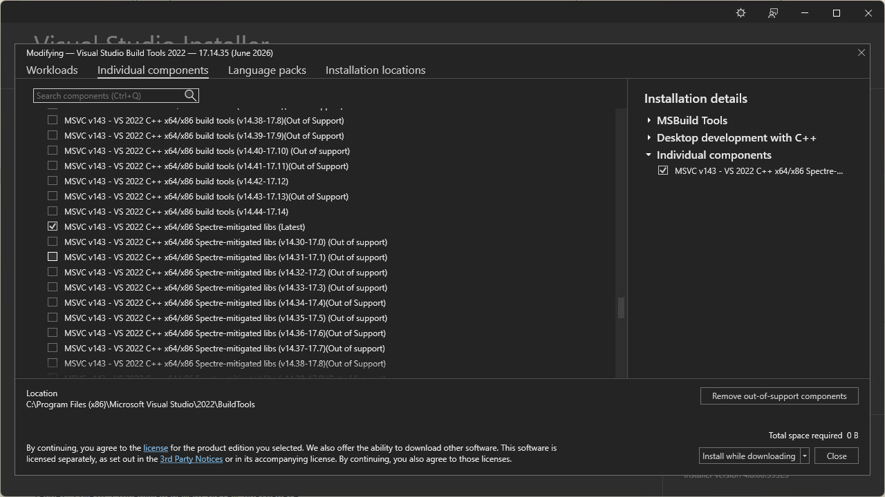

# Troubleshooting

## Bazel C/C++ Toolchain Autodetection Fails

### Problem

During the Bazel setup, I encountered the following linker error:

```text
The target you are compiling requires Visual C++ build tools.
Bazel couldn't find a valid Visual C++ build tools installation on your machine.

Visual C++ build tools seems to be installed at D:\Microsoft Visual Studio 2022 Preview\VC\Tools\MSVC\14.43.34604\bin\Hostx64\x64
But Bazel can't find the following tools:
    VCVARSALL.BAT, cl.exe, link.exe, lib.exe, ml64.exe
for x64 target architecture

Please check your installation following https://bazel.build/docs/windows#using
```

### Cause

The `BAZEL_VC` environment variable was not set to the Visual C++ Build Tools installation directory.

### Solution

Run the following command in PowerShell:

```powershell
$env:BAZEL_VC = "C:\Program Files\Microsoft Visual Studio\2022\BuildTools\VC"
```

### References
* https://github.com/bazelbuild/bazel/issues/18816

# LNK1104: cannot open file `MSVCRT.lib`

## Problem

When building a project with Bazel on Windows, the linker may fail with the following error:

```text
LINK : fatal error LNK1104: cannot open file 'MSVCRT.lib'
```

## Cause

This error typically occurs because the Visual Studio Build Tools were installed without the required C++ libraries or Windows SDK components. As a result, the Microsoft C Runtime (`MSVCRT.lib`) cannot be found during the linking stage.

## Solution

Modify your Visual Studio Build Tools installation and ensure the following components are installed:

- **MSVC v143 (or later) C++ x64/x86 Build Tools**
- **Windows 10 SDK** or **Windows 11 SDK**
- **C++ build tools workload**

The required component is highlighted below:



## References

- Microsoft Learn: <https://learn.microsoft.com/en-us/cpp/error-messages/tool-errors/linker-tools-error-lnk1104>
- Stack Overflow: <https://stackoverflow.com/questions/22426367/fatal-error-lnk1104-cannot-open-file-msvcrt-lib>

## clang-tidy Doesn't Work on Windows

### Problem

`bazel build --config=lint` fails on Windows, `toolchains_llvm` which clang-tidy cames from hasn't Windows build, and the `tools/lint/BUILD.bazel` needs a local `clang-tidy.exe` which I couldn't get Bazel to accept, no matter what I did.

Using the filename (`src = "clang-tidy.exe"`) makes Bazel look for it as a source file inside the package:

```text
ERROR: Creating symlink tools/lint/clang_tidy [for tool] failed:
missing input file '//tools/lint:clang-tidy.exe'
```

Using the real install path (`src = "C:/Program Files/LLVM/bin/clang-tidy.exe"`) is parsed as a label too — and labels can't start with `/`:

```text
ERROR: invalid label 'C:/Program Files/LLVM/bin/clang-tidy.exe' ...
target names may not start with '/'
```

### Cause

1. `toolchains_llvm` has no Windows toolchain — [toolchains_llvm#4](https://github.com/bazel-contrib/toolchains_llvm/issues/4).
2. `native_binary.src` takes a **Bazel label**, not a filesystem path. Bazel is hermetic on purpose — it won't reach into `C:\Program Files\` on its own. To use a system binary you'd have to either copy the exe into the package or expose the install dir as a `new_local_repository`. Both are brittle and per-machine.

### Solution

Moved to WSL. 
SHAME ON WINDOWNS USERs 

```bash
bazel build //main:LibraryManagementSystem --config=lint
```

Build and run still work fine on native Windows, only the linter needs WSL.

### References

- <https://github.com/bazel-contrib/toolchains_llvm/issues/4>

## -- TEMPLATE --

### Problem

### Cause

### Solution

### References